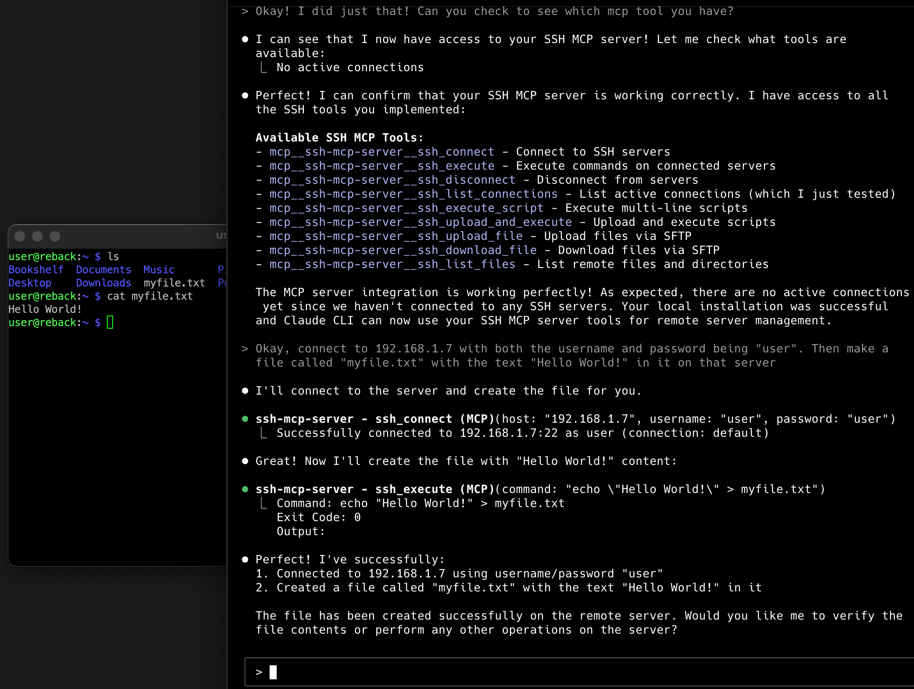

# SSH MCP Server

[](https://badge.fury.io/js/@zibdie%2Fssh-mcp-server)
[](https://github.com/zibdie/SSH-MCP-Server/actions/workflows/ci.yml)
[](https://opensource.org/licenses/MIT)

A cross-platform Model Context Protocol (MCP) server that provides SSH connectivity tools. This server enables AI assistants to securely connect to and execute commands on remote servers via SSH.

## Features

- **Cross-platform compatibility**: Works on Windows, macOS, and Linux
- **Multiple authentication methods**: Username/password and SSH key authentication
- **IPv4 and IPv6 support**: Connect to servers using either IP version
- **Multiple connections**: Manage multiple SSH connections simultaneously
- **Comprehensive file operations**: Upload, download, and list files via SFTP
- **Script execution**: Run bash, python, and other scripts remotely
- **Secure**: Uses the robust `ssh2` library for secure connections
- **MCP compatible**: Works with Claude CLI, Claude Desktop, and other MCP clients

## Installation & Setup

### Quick Setup (Recommended)

1. **Add to Claude CLI with one command:**

   ```bash
   claude mcp add ssh-mcp-server npx '@zibdie/ssh-mcp-server@latest'
   ```

   **Windows Note:** If you encounter MCP server startup issues on Windows, ensure you're using a supported terminal (Windows Terminal, PowerShell, or Git Bash) and that the Claude CLI has proper stdin support.

2. **Restart Claude CLI**

3. **Test the connection:**
   ```
   "Connect to my server at example.com with username myuser"
   ```

### Alternative: Manual Installation

#### For Claude CLI

1. **Install globally:**

   ```bash
   npm install -g @zibdie/ssh-mcp-server
   ```

2. **Add to configuration:**

   **macOS/Linux**: Edit `~/.config/claude/claude_desktop_config.json`  
   **Windows**: Edit `%APPDATA%\Claude\claude_desktop_config.json`

   ```json
   {
     "mcpServers": {
       "ssh-mcp-server": {
         "command": "ssh-mcp-server"
       }
     }
   }
   ```

#### For Claude Desktop

1. **Install globally:**

   ```bash
   npm install -g @zibdie/ssh-mcp-server
   ```

2. **Add to configuration:**

   **macOS**: Edit `~/Library/Application Support/Claude/claude_desktop_config.json`  
   **Windows**: Edit `%APPDATA%\Claude\claude_desktop_config.json`

   ```json
   {
     "mcpServers": {
       "ssh-mcp-server": {
         "command": "ssh-mcp-server"
       }
     }
   }
   ```

## Demo

Here's an example of the SSH MCP server in action, showing file upload capabilities:



_Example: Uploading and managing files on remote servers through Claude using the SSH MCP server_

## Available Tools

### `ssh_connect`

Connect to an SSH server using password or SSH key authentication.

**Parameters:**

- `host` (required): SSH server hostname or IP address (IPv4 or IPv6)
- `port` (optional): SSH server port (default: 22)
- `username` (required): Username for SSH authentication
- `password` (optional): Password for authentication
- `privateKey` (optional): Path to private SSH key file
- `passphrase` (optional): Passphrase for encrypted private key
- `connectionId` (optional): Unique identifier for this connection (default: "default")

### `ssh_execute`

Execute a command on an established SSH connection.

**Parameters:**

- `command` (required): Command to execute on the remote server
- `connectionId` (optional): Connection ID to use (default: "default")
- `timeout` (optional): Command timeout in milliseconds (default: 30000)

### `ssh_disconnect`

Disconnect from an SSH server.

**Parameters:**

- `connectionId` (optional): Connection ID to disconnect (default: "default")

### `ssh_list_connections`

List all active SSH connections.

### `ssh_upload_file`

Upload a file to the remote server via SFTP.

**Parameters:**

- `localPath` (required): Local file path to upload
- `remotePath` (required): Remote destination path
- `connectionId` (optional): Connection ID to use (default: "default")
- `createDirs` (optional): Create remote directories if they don't exist (default: true)

### `ssh_download_file`

Download a file from the remote server via SFTP.

**Parameters:**

- `remotePath` (required): Remote file path to download
- `localPath` (required): Local destination path
- `connectionId` (optional): Connection ID to use (default: "default")
- `createDirs` (optional): Create local directories if they don't exist (default: true)

### `ssh_list_files`

List files and directories on the remote server.

**Parameters:**

- `remotePath` (optional): Remote directory path to list (default: ".")
- `connectionId` (optional): Connection ID to use (default: "default")
- `detailed` (optional): Show detailed file information (default: false)

## Examples

### Basic Connection Examples

**User prompt:** "Connect to my server at 192.168.1.100 with username admin and password mypass123"

```
ssh_connect with host="192.168.1.100", username="admin", password="mypass123"
```

**User prompt:** "SSH into my development server using my private key"

```
ssh_connect with host="dev.example.com", username="developer", privateKey="~/.ssh/id_rsa"
```

**User prompt:** "Connect to my IPv6 server with SSH key authentication"

```
ssh_connect with host="2001:db8::1", username="user", privateKey="/home/user/.ssh/dev_key", passphrase="keypassword"
```

### Command Execution Examples

**User prompt:** "Check the disk space on my server"

```
ssh_execute with command="df -h"
```

**User prompt:** "Show me what processes are running"

```
ssh_execute with command="ps aux | head -20"
```

**User prompt:** "Run a system update on my Ubuntu server"

```
ssh_execute_script with script="""
sudo apt update
sudo apt upgrade -y
sudo apt autoremove -y
echo "System update completed"
""", interpreter="bash"
```

### File Transfer Examples

**User prompt:** "Copy the hello.zip file from my server's desktop to my desktop"

```
ssh_download_file with remotePath="/home/user/Desktop/hello.zip", localPath="~/Desktop/hello.zip"
```

**User prompt:** "Upload my config.json file to the server's /etc/myapp/ directory"

```
ssh_upload_file with localPath="./config.json", remotePath="/etc/myapp/config.json"
```

**User prompt:** "Send my backup script to the server and run it"

```
ssh_upload_and_execute with script="""
#!/bin/bash
mkdir -p /backup/$(date +%Y%m%d)
tar -czf /backup/$(date +%Y%m%d)/data_backup.tar.gz /var/www/html
echo "Backup completed successfully"
""", filename="backup.sh", interpreter="bash"
```

**User prompt:** "Show me what's in the /var/log directory with file sizes"

```
ssh_list_files with remotePath="/var/log", detailed=true
```

### Multi-Server Management Examples

**User prompt:** "Connect to both my production and staging servers"

```
ssh_connect with host="prod.example.com", username="admin", privateKey="~/.ssh/prod_key", connectionId="production"
ssh_connect with host="staging.example.com", username="admin", privateKey="~/.ssh/staging_key", connectionId="staging"
```

**User prompt:** "Check uptime on both servers"

```
ssh_execute with command="uptime", connectionId="production"
ssh_execute with command="uptime", connectionId="staging"
```

**User prompt:** "Deploy my app to staging server"

```
ssh_upload_file with localPath="./myapp.tar.gz", remotePath="/tmp/myapp.tar.gz", connectionId="staging"
ssh_execute_script with script="""
cd /var/www
sudo tar -xzf /tmp/myapp.tar.gz
sudo systemctl restart nginx
sudo systemctl restart myapp
echo "Deployment completed"
""", connectionId="staging", interpreter="bash"
```

### Advanced Scripting Examples

**User prompt:** "Run a Python script to analyze server performance"

```
ssh_execute_script with script="""
import psutil
import json

# Get system info
cpu_percent = psutil.cpu_percent(interval=1)
memory = psutil.virtual_memory()
disk = psutil.disk_usage('/')

report = {
    'cpu_usage': cpu_percent,
    'memory_usage': memory.percent,
    'disk_usage': (disk.used / disk.total) * 100,
    'available_memory_gb': memory.available / (1024**3)
}

print(json.dumps(report, indent=2))
""", interpreter="python3"
```

**User prompt:** "Monitor my application logs in real-time"

```
ssh_execute with command="tail -f /var/log/myapp/application.log", timeout=60000
```

**User prompt:** "Backup my database and download it"

```
ssh_execute_script with script="""
timestamp=$(date +%Y%m%d_%H%M%S)
mysqldump -u dbuser -p'dbpass' mydatabase > /tmp/backup_$timestamp.sql
gzip /tmp/backup_$timestamp.sql
echo "Backup created: /tmp/backup_$timestamp.sql.gz"
""", interpreter="bash"

# Then download the backup
ssh_download_file with remotePath="/tmp/backup_20241203_143022.sql.gz", localPath="./database_backup.sql.gz"
```

## Security Considerations

- This tool provides direct SSH access to remote servers
- Always use strong authentication (prefer SSH keys over passwords)
- Be cautious when executing commands with elevated privileges
- Ensure proper network security and access controls
- Private keys and passwords are handled securely in memory
- Never commit credentials to version control

## Requirements

- Node.js 18 or higher
- Network access to target SSH servers
- Valid SSH credentials for target servers

## Troubleshooting

### Common Issues

1. **"Command not found" after global install**

   ```bash
   # Ensure npm global bin is in your PATH
   npm config get prefix
   export PATH="$(npm config get prefix)/bin:$PATH"
   ```

2. **MCP server not appearing in Claude**

   - Verify configuration file path and JSON syntax
   - Restart Claude CLI/Desktop after configuration changes
   - Check Claude logs for connection errors

3. **SSH connection failures**

   - Verify network connectivity to target server
   - Ensure SSH service is running on target server
   - Check firewall settings and port accessibility
   - Validate SSH credentials and key permissions

4. **Permission errors**
   - Ensure SSH keys have correct permissions (600)
   - Verify user has necessary privileges on target server

## Development

### Local Development

1. Clone the repository:

   ```bash
   git clone https://github.com/zibdie/SSH-MCP-Server.git
   cd SSH-MCP-Server
   ```

2. Install dependencies:

   ```bash
   npm install
   ```

3. Run in development mode:

   ```bash
   npm run dev
   ```

4. Test with MCP Inspector:
   ```bash
   npx @modelcontextprotocol/inspector node index.js
   ```

## API Reference

For detailed API documentation of all available tools and their parameters, see the [Examples](#examples) section above.

## License

MIT - see [LICENSE](LICENSE) file for details

## Author

Nour Zibdie ([https://nour.zibdie.com](https://nour.zibdie.com))

## Repository

https://github.com/zibdie/SSH-MCP-Server

## Support

- [Issues](https://github.com/zibdie/SSH-MCP-Server/issues)
- [Discussions](https://github.com/zibdie/SSH-MCP-Server/discussions)
